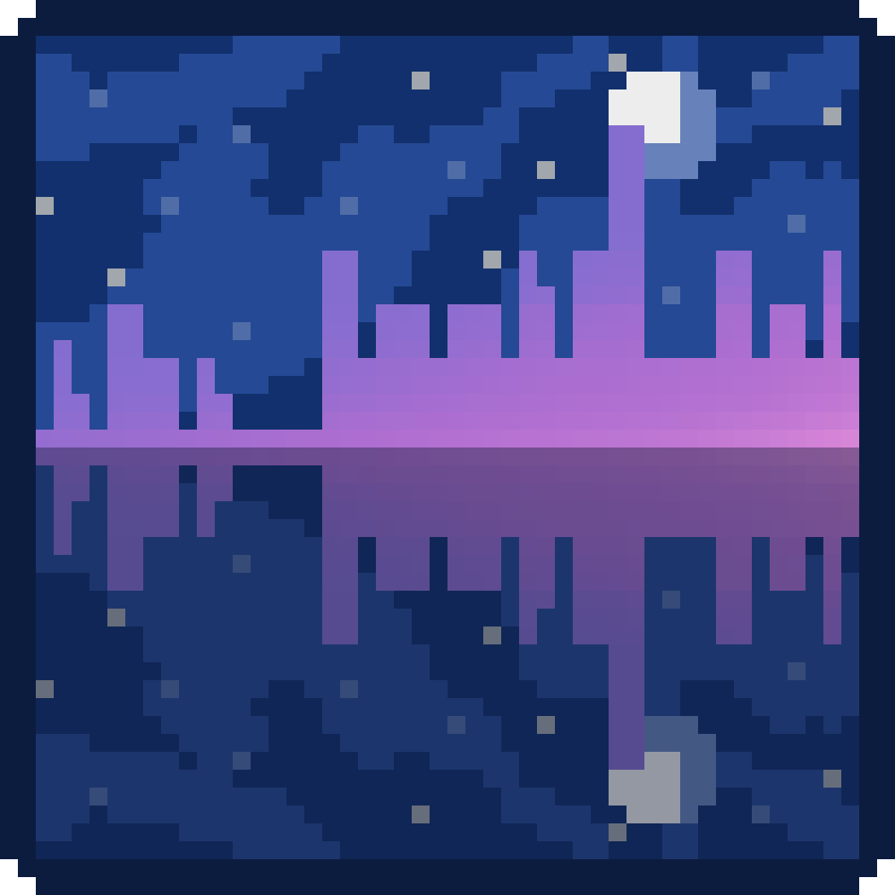
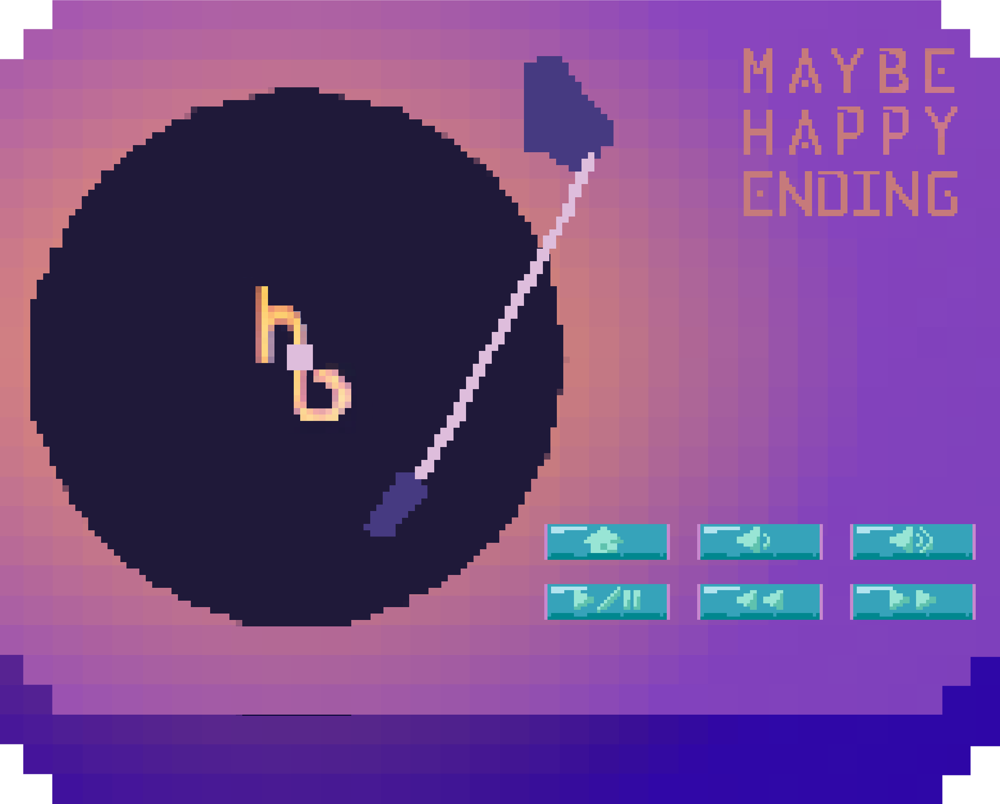
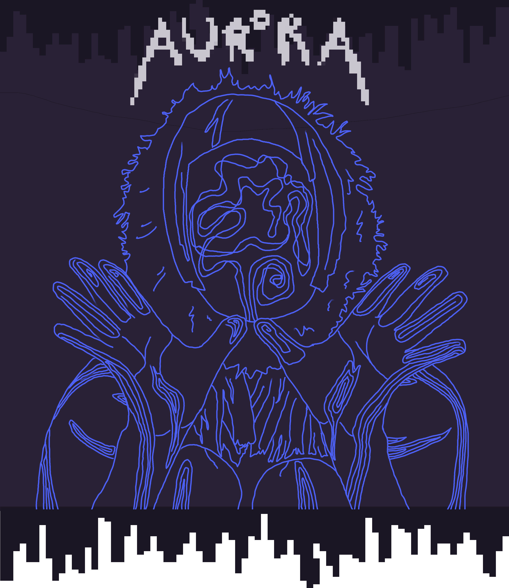
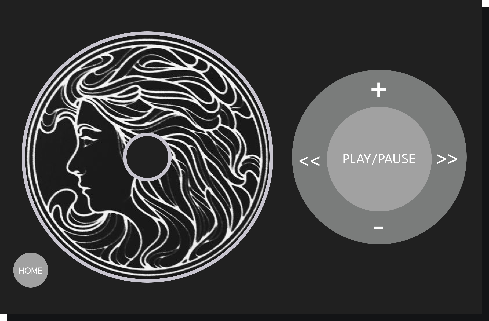
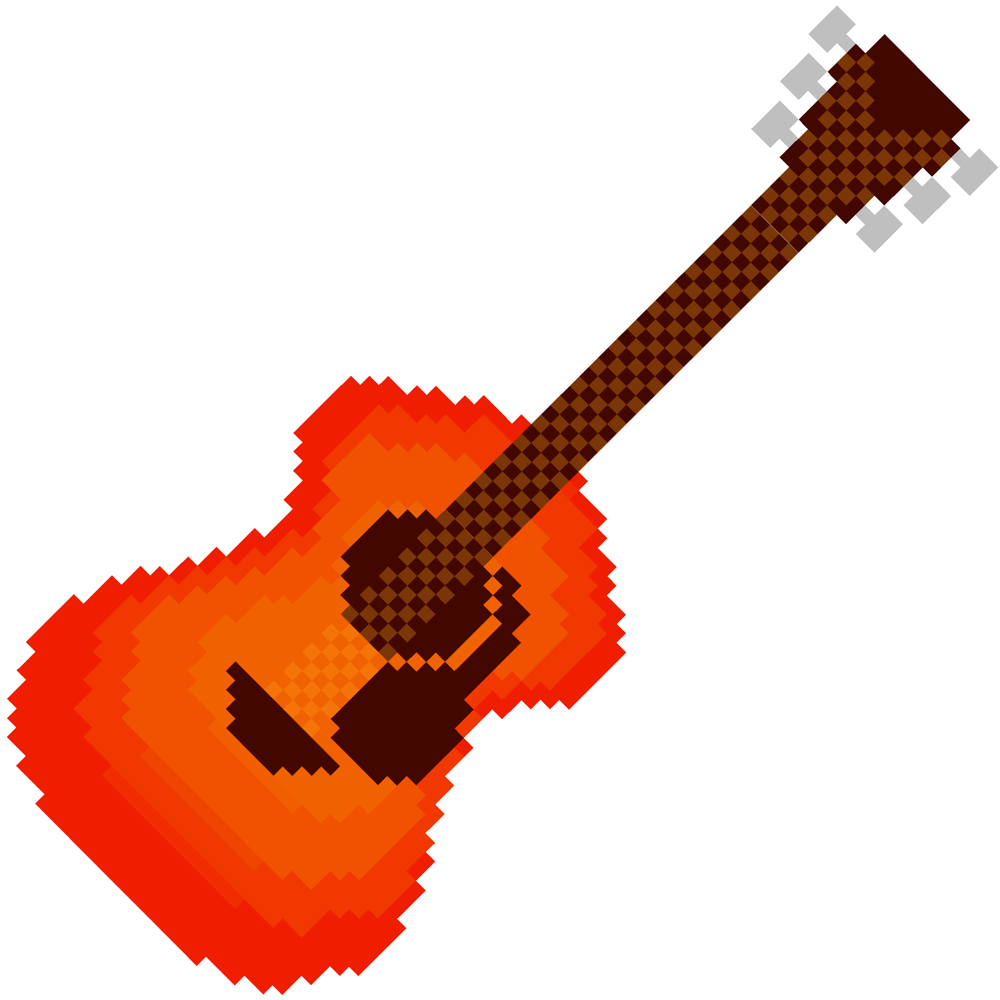
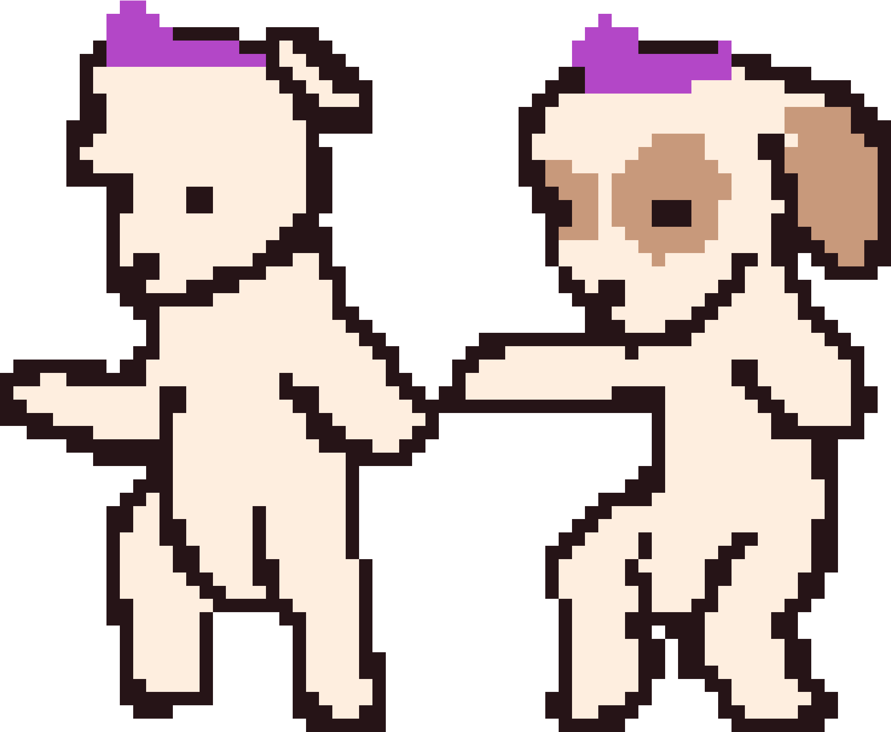
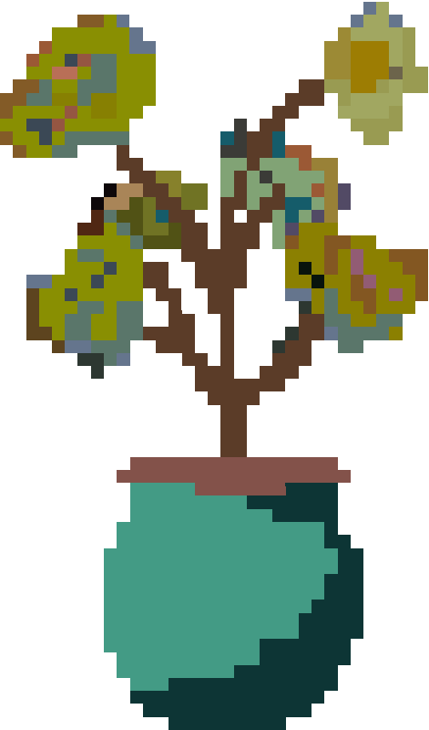
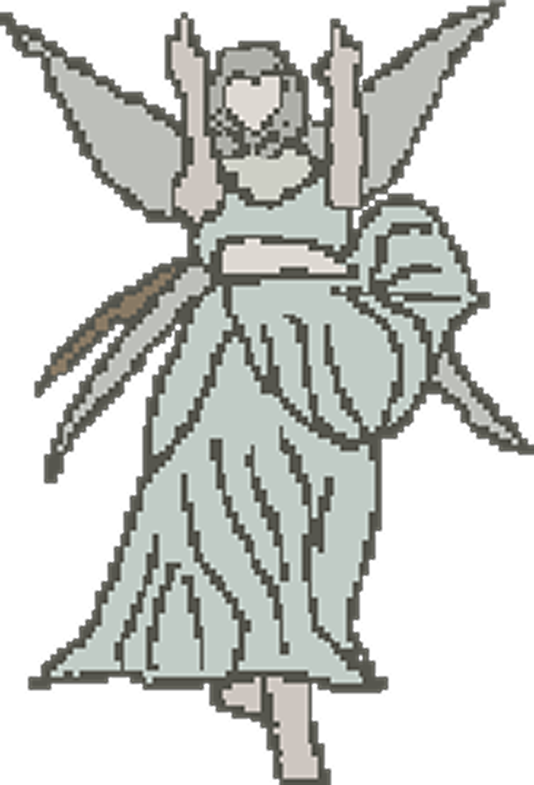

# music-player

Desktop music player app inspired by nashallery and the Barble The Island Princess CD player I used to have as a kid. Built using Javascript and HTML/CSS in Electron, and made cute using Procreate and Figma.

Currently features bops from Ponyo on the Cliff By the Sea, various Barbie movie soundtracks, Maybe Happy Ending, A Different Kind of Human (Step II), and Pure Heroine. Audio files are not included the repository for copyright reasons, but should be uploaded to assets/audios.


To run this music player, after cloning for the first time, run the following command
```shell
npm install electron --save-dev
```

Then, to launch the app, run
```shell
npm start
```

To build into a packaged app, first run the following commands to import into Forge:
```shell
npm install --save-dev @electron-forge/cli
npx electron-forge import
```

Then to build a distributable, run
```shell
npm run make
```

<div>
  
  
  
  
  
  
  
  
  
  
  
</div>
